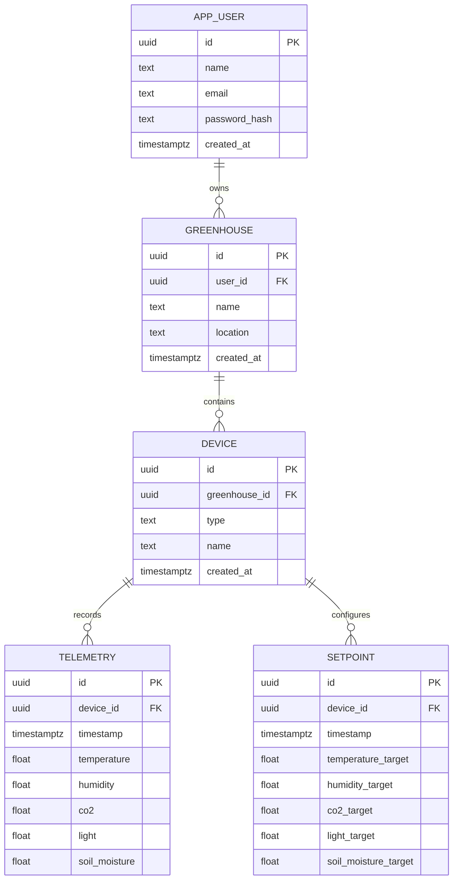

# Database Documentation

This document provides a comprehensive overview of the PostgreSQL + TimescaleDB database used in this project.  
It covers schema design, entity relationships, initialization, and usage.

---

## 📂 Schema Overview

The system is designed to manage **users**, **greenhouses**, and their associated **devices**, while storing telemetry and setpoints data.  

### Main Entities:
- **Users (`app_user`)**
- **Greenhouses (`greenhouse`)**
- **Devices (`device`)**
- **Telemetry (`telemetry`)**
- **Setpoints (`setpoint`)**

---

## 🗂️ Entity Relationship Diagram (ERD)

## ⚙️ Initialization

On container startup, the database is automatically initialized using the `init.sql` script.  
This script creates all required tables, indexes, and extensions.

### Key points:
- **UUID extension** enabled.
- **TimescaleDB extension** enabled for efficient time-series storage.
- Foreign key constraints ensure relational integrity.

---

## 📊 Tables

### `app_user`
Stores system users.  
- **id**: UUID (Primary Key)  
- **name**: Text  
- **email**: Text (unique)  
- **password_hash**: Text (hashed password)  
- **created_at**: Timestamp with timezone  

### `greenhouse`
Represents a greenhouse.  
- **id**: UUID  
- **user_id**: References `app_user(id)`  
- **name**: Greenhouse name  
- **location**: Text  
- **created_at**: Timestamp with timezone  

### `device`
Represents a physical device inside a greenhouse.  
- **id**: UUID  
- **greenhouse_id**: References `greenhouse(id)`  
- **type**: Device type (e.g., "sensor", "actuator")  
- **name**: Text  
- **created_at**: Timestamp with timezone  

### `telemetry`
Time-series sensor data linked to a device.  
- **id**: UUID  
- **device_id**: References `device(id)`  
- **timestamp**: Timestamp with timezone  
- **temperature**, **humidity**, **co2**, **light**, **soil_moisture**  

### `setpoint`
Desired target values for devices.  
- **id**: UUID  
- **device_id**: References `device(id)`  
- **timestamp**: Timestamp with timezone  
- **temperature_target**, **humidity_target**, **co2_target**, **light_target**, **soil_moisture_target**  

---
